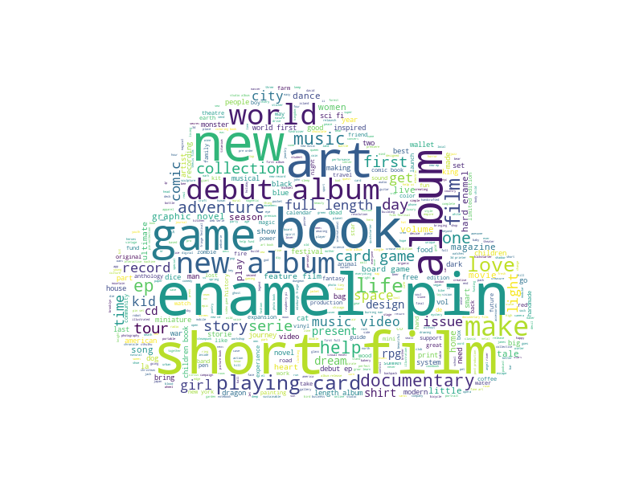

```{r setup, include=FALSE}
knitr::opts_chunk$set(echo = F)
```

```{r libload, include=F}
rm(list=ls())
library(ggplot2)
library(cowplot)
library(data.table)
library(dplyr)
library(arm)
library(pROC)
library(e1071)
library(caret)
library(car)
```

```{r dataload}
df = read.csv('processed_data/KSData_191205.csv')
df = as.data.table(df)
df$goal_c = df$usd_goal - mean(df$usd_goal)
df$ttld_c = df$ttl_days - mean(df$ttl_days)
df$response = (as.numeric(df$state)-1)

df = subset(df, select=-c(location_id, state_changed_at, country, 
                             backers_count, usd_pledged, deadline,
                             launched_at))
df = df[complete.cases(df),]

```

# Introduction
	
Crowdfunding is the practice of raising the capital necessary for funding a given project through the support of public patrons instead of the traditional methods of venture-capitalism or bank loans. Online crowdfunding surfaced after the 2008 recession, when independent early projects needed to acquire funding from alternative sources during that uncertain economic climate [1]. 
	
Kickstarter is one of the famous crowdfunding online-platforms that connects project creators with potential customers that may be interested in the project. Project creators would set a funding goal of the amount of money the project would need to become a reality and a deadline to reach that goal. “Backers” would then pledge money towards that project to help fund it. Kickstarter operates on an “all-or-nothing” funding philosophy: if the funding goal is not met before the deadline, the backers are not charged, the project creator does not receive any of the funding and the project fails. This study explores the possible factors that lead to a project’s chances of success and attempts to quantify their effects.

# Data Acquisition and Preprocessing

The data used in this paper has been collected through Kickstarter’s own web API by webrobots.io [2]. The collection process was performed by running scheduled monthly scrape-jobs. I this project, we are using data collected that was scraped between October 2015 and October 2019 for a total of 48 JSON files. This includes historical projects that were launched since 2009.
  
After obtaining the original data, additional preprocessing and filtering of the records is required. The data records include inner JSON objects with information that is not relevant to the research questions, such as webpage properties, photo dimensions, and related URLs. The data also has duplicated records of the same project scraped at different times. We created a script that keeps only the latest record of each project, and extracts the relevant fields from the JSON record.

Kickstarter has no public documented API and therefore there is no official data dictionary. Some of the columns are named sufficiently and others have been identified through 3rd parties [3]. Because the API changed across the years , with features being added or removed, we only kept the columns that were shared across all records. Except for the case of the `staff_pick` column (a true or false value that determines whether a project has the "projects we love" badge) since there was no official badge on projects that were launched before 2016, we filled the missing values for old projects with `False`.

Since Kickstarter is an open platform, we needed a way to filter outlier projects. An outlier project is a project that meets either of the following conditions:

- A funding goal less than $50, this goal does not warrant a fundraising campaign.

- A funding goal greater than $100,000 with less than 10 backers. We believe these creators were not seriously attempting to fund their projects, since securing less than 10 backers portrays a lackluster marketing effort for such an ambitious funding goal.

Filtering the outliers removes less than 2% of the data, with the final processed data containing 303858 unique projects. All the monetary amounts were converted to USD for consistency and all continous variables have been mean centred.

# Feature Engineering

The timing of when a project's fundraising campaign starts could be an important factor in whether or not a somone chooses to "back" the project. Using the Unix time of the project's launch and deadline that was provided in the original dataset, additional datetime features were created. The year, month, day, weekday of the launch, and The number of days between the launch date and the deadline were all considered as potential predictors.

A creator's record could be important to a prospective "Backer", so a boolean value of whether a project creator has had a previously successful/failed project in their history was added as a predictor.

Given the belief in the importance of a project's name, we created a metric to calculate its uniqueness respective to others in its category. This was done by using word embeddings[4]. Word embeddings are a way of representing words in vector-space where words that are semanticaly similar appear closer to each other. The cosine distance between each project's name vector and the average category vector gives us our value.
The following images show a wordcloud of successful and failed project names respectively:

{#id .class width=50% height=50%}
{#id .class width=50% height=50%}

# EDA
```{r plot_functions}
grouped_bars = function(data, groups, labels, flip=T) {
  
  gdf = df[, .(count = .N), groups]
  gdf = gdf %>% group_by(get(groups[1])) %>% mutate(percent = count/sum(count))
  
  p = ggplot(gdf)+
    geom_bar(aes(x=get(groups[2]), 
                 fill=get(groups[2]), 
                 y=percent*100), 
             stat='identity', 
             width=.2)+
    facet_grid(~get(groups[1]))+
    geom_text(data = gdf, 
              aes(x=get(groups[2]), 
                  y=percent*100, 
                  label=scales::percent(round(percent, 4))), 
              vjust=-.3)+
    theme(
      axis.text.x = element_blank(),
      legend.position = "None",
      axis.title.x = element_text(size = 10),
      axis.title.y = element_text(size = 10)
    )+
    xlab(labels[1])+
    ylab(labels[2])
  if(flip){
    p = p + coord_flip()}
  
  return(p)
}

percentage_bars = function(data, group, labels, flip=T) {
  
  gdf = df[, .(count = .N), group]
  gdf = gdf %>% group_by(get(group)) %>% mutate(percent = count/sum(gdf$count))
  
  p = ggplot(gdf)+
    geom_bar(aes(x=get(group), 
                 fill=get(group), 
                 y=percent*100), 
             stat='identity', 
             width=.2)+
    geom_text(data = gdf, 
              aes(x=get(group), 
                  y=percent*100, 
                  label=scales::percent(round(percent, 4))), 
              hjust=-.3)+
    theme(
      axis.text.x = element_blank(),
      legend.position = "None",
      axis.title.x = element_text(size = 10),
      axis.title.y = element_text(size = 10)
    )+
    xlab(labels[1])+
    ylab(labels[2])
  if(flip){
    p = p + coord_flip()}
  
  return(p)
}

```

Thankfully, the data is almost perfectly balanced with 51% of the projects succeeding to meet their funding goal. The data includes projects based in 22 unique countries, with most of the projects being based in either the United States, Canada or Great Britain. 
Due to the imbalanced distribution we decided to group the countries based on location, the groups are:

|Group|Countries|
|---|---|
|Europe|Italy, Germany, Spain, Netherlands, Belgium, Luxemburg, Austria, Denmark, France, Ireland, Norway, Sweden|
|North America|United States, Canada, Mexico|
|Asia|Hong Kong, Singapore, Japan|
|Oceania|Australia, New Zealand|
|Great Britain|England, Scotland, Wales, North Ireland|


```{r plots, fig.width=10, fig.height=4}
# p1 = grouped_bars(df, c('main_category', 'state'), c('Primary Categories', 'Percentage of Success Rates'), F)
p2 = grouped_bars(df, c('country_group', 'state'), c('Country Group', 'Percentage of Success Rates'), F) 
p3 = grouped_bars(df, c('staff_pick', 'state'), c('Featured by Staff', 'Percentage of Success Rates'), F)
p4 = grouped_bars(df, c('previously_successful', 'state'), c('Creator has Succesfully Funded a Project Before', 'Percentage of Success Rates'), F)

cowplot::plot_grid(p2, cowplot::plot_grid(p3,p4, ncol=2), scale=.93, rel_heights=c(1.3,1))

```

From the EDA plots, we see that they corroborate some of what we suspected when we stated feature engineering. The rates of a project's success vary based on its launch dates, location, whether it has been featured by the staff, and the project creator's history. The insight gained here will guide the model selection process.

NOTE: Additional EDA plots available in the Appendix

# Model

To answer the main research question of what factors affect a project's chances of success, we set that as the model's response variable. All the base predictors were included with the addition of the engineered features and interactions such as the interaction between the funding goal and the campaign length. Stepwise AIC is then preformed to optimize that selection. The final selected model's formula is:

$Logit(\hat\pi_{success}) = \beta_0USD\_goal_{centered}+\beta_1TTL\_days_{centered}+\beta_2Staff\_Pick +$ $\beta_3Previously\_Successful + \beta_4Previously\_Failed + \beta_5USD\_goal_{centered}:TTL\_days_{centered}+\beta_6Name\_Uniqueness+$
$\sum_{j=2}^{J}\beta_{7j}Main\_Category + \sum_{j=2}^{J}\beta_{8j}Country\_Group +$
$\sum_{j=2}^{J}\beta_{9j}Launch\_year +\sum_{j=2}^{J}\beta_{10j}Launch\_month +$
$\sum_{j=2}^{J}\beta_{11j}Launch\_Day +\sum_{j=2}^{J}\beta_{12j}Launch\_WeekDay$


```{r model, warning=F}
model = glm(response ~ main_category + staff_pick + previously_successful +
    as.factor(launch_year) + goal_c + ttld_c + name_uniqueness +
    previously_failed + launch_month + country_group + launch_wday +
    as.factor(launch_day) + goal_c:ttld_c, family = binomial, data=df)
```

The model has an AUC of 0.8, an Accuracy of 72% and a Sensitivity of 68%
Checking the VIF of the model shows that there is no collinearity between our predictors. However, inspecting the binned diagnostic plots (Available in the Appendix) we see some anomalies in the plot that no amount of transformation or binning has fixed. We will proceed to the inference with caution.

# Results & Conclusion

From the final model, we can say with reasonable confidence that compared to the baseline (an Art project based in Asia by a first-time creator with an average funding goal of $12450, an average name within its categoray, a ttl of 33 days that launched on a Friday on April 2009).

- A creator that has successfully funded a project is 6.4 times more likely to successfully fund subsequent projects
- A creator that has previously failed at funding a project is 53% less likely to successfully fund subsequent projects
- Projects based in Europe are 44% less likely to succeed
- Staff pick increases the odds ratio by a factor of 9.6
- the categories most likely to succeed are Design (6.37), Theater (3.86) then Comics (53% more likely)
- projects that have names which are semantically different than projects in their category are less likely to succeed ( 8% less likely per .1 cosine distance)
- March projects are 7% more likely to succeed and July projects are 20% less likely to succeed
- Projects launched on a Tuesday are 20% more likely to succeed
- Launching a project on the first day of the month is at least 13% more likely to succeed than a similar project that launches on any other day
- The likelihood of a project's success decreases by 2% for every additional day they add to the average fundraising campaign length (33 days).
- The likelihood of a project's success decreases by (2e-5)% for every additional dollar they add to the average funding goal ($12450).


it should be noted that this model has some limitations, The binned residual plot has some abnormalities as mentioned previously. The data is also missing some highly relevant information that would be useful for future work, such as the reward tiers of the project, the promotional video attached to the project and the popularity of creator prior to their project.

All the code used for this project can be found on https://github.com/abdaloth/ks-success

\newpage
# References

[1] Calic, G. (2018). Crowdfunding. In B. Warf (Ed.), The SAGE Encyclopedia of the internet (pp. 112-114). Thousand Oaks,, CA: SAGE Publications, Inc. doi: 10.4135/9781473960367.n40

[2] Kickstarter Datasets, Retrieved from https://webrobots.io/kickstarter-datasets/

[3] Kickstarter API description, Retrieved from https://github.com/markolson/kickscraper/wiki/Datatypes

[4] Mikolov, Tomas; et al. (2013). "Efficient Estimation of Word Representations in Vector Space". arXiv:1301.3781


# Appendix

```{r appendix}

binnedplot(x=fitted(model),y=residuals(model,"resp"),xlab="Pred. probabilities",
           col.int="red4",ylab="Avg. residuals",main="Binned residual plot",col.pts="navy")

grouped_bars(df, c('main_category', 'state'), c('Primary Categories', 'Percentage of Success Rates'), F)
grouped_bars(df, c('previously_failed', 'state'), c('Creator has Failed a Previous Project', 'Percentage of Success Rates'), F)

percentage_bars(df,'main_category', c('Primary Categories', 'Percentage of Projects per Category'), T)
percentage_bars(df,'country_group', c('Country Group', 'Percentage of Projects per Group'), T)
percentage_bars(df,'staff_pick', c('Primary Categories', 'Percentage of Projects that were picked'), T)

jtools::summ(model, exp = TRUE, digits=3, model.info = FALSE, model.fit = FALSE)

```
